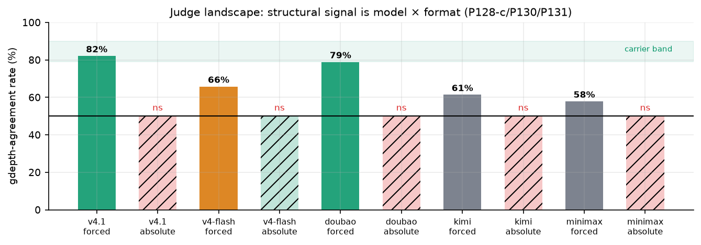
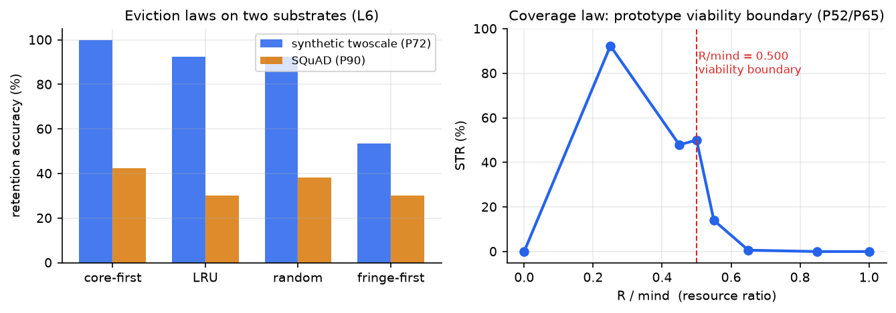
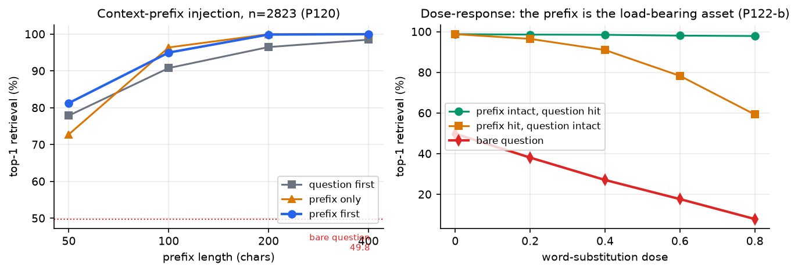

# Intuition-Mechanism Program

<p align="center">
  <a href="README.zh-CN.md">中文</a> · <b>English</b>
</p>

**Build your own System-One judge: verified, calibrated, audit-trail included.**

**Insight Mechanism Reproduction Program** — a Mushroom-Body Program track.
**Canonical research state: [docs/RESEARCH_PLAN.md](docs/RESEARCH_PLAN.md)**
(pre-registered experiment registry, 198 numbered rows P1–P198, every row with prediction, verdict and artifacts).  This README is the
detailed entry point.

> Central question: can Ramanujan-style formula discovery be reduced to a
> mechanical pipeline?  Which steps are the "inspiration", and can they be
> reproduced by a machine and their signature measured?

## TL;DR — the program in plain words

**What is this?** A three-year attempt to take apart what "I feel this is
right" means — for AI and for us — using one clean math mystery as the test
rig. There exist six *magic numbers* (1, 3, 5, 7, 13, 17) that make a
certain quantity land exactly on integers (8, 12, 20, 32, 104, 200); every
other value misses forever. Classical number theory knew the phenomenon but
not the reason. We let AI models guess the rule from data, then use **code
as the judge**: a guessed rule only counts if it passes unseen exam
questions — one miss and it is a hallucination.

**Three things a week of intensive research surfaced:**

1. **The math**: *why* exactly those six numbers is now almost fully
   explained — the class group decides which values are even eligible, and
   two grade-school remainder rules (d mod 3 and d mod 4) pick the landing
   field. One theorem remains.
2. **The AI behavior**: what a model *says* its rule is and what it
   *actually uses* are routinely different — stated rules score ~50% (pure
   chance) when executed, operative judgments score ~90%. Models know more
   than they can say, and their *wrong stated rules predict their exact
   errors*.
3. **The method**: an automated "propose → exam → feed back errors → revise"
   loop now runs end-to-end. It self-corrects — and, measurably, it
   *memorizes rather than discovers* when data lacks positive examples.
   That failure mode is itself a quantified result.

**Entry points**: story-only → keep reading; reproduce numbers →
[docs/RESEARCH_PLAN.md](docs/RESEARCH_PLAN.md) (198 numbered experiments,
each with prediction/verdict/artifacts); use the judge toolkit → the
plugin section below.

## What you get (the intuition-pack plugin, P140-P169)

This repo ships `intuition_pack/` — an open protocol for building **your
own Jev-class judgment engine** against any domain, without training:

```
pack_probe      is your domain a compression domain?  (learning curve)
pack_build      distill contrast exemplars + charter + verifier spec
verify / score  mechanical verdicts with full audit trails + abstain
regression      mechanical gate — a pack version ships only if it passes
hook / MCP      auto-injection into your agent's context per domain
```

Every judgment passes **four mechanically-checked conditions**
(Compression / Verification / Transfer / Novelty) — the
Insight-vs-Hallucination boundary is enforced by code, not by a judge's
opinion.  Your data stays local; the verifier registry (10 verifiers +
templates) covers execution, predicate, numeric, schema, set, and regex
shapes.

Measured positioning vs [Jev](https://arxiv.org/html/2609.37647v1)
(the trained System-One discriminator this protocol was benchmarked
against): on the shared dataset (SMS Spam, n=200) zero-shot LLM judges
tie it (96.0-97.0% vs 96.5%) and the pack lifts to **97.5% with a
confidence gate at 99.5% / 91% coverage** (Jev: 95.5% / 63%); on
verifier-backed domains the mechanical layer scores **100% with ECE
0.0075 at $0 and 0.37 ms**.  What this is NOT: a replacement for Jev's
breadth (37 datasets, 432 ms forward pass).  What it is: the
**distillation source and calibration harness** — every judgment in the
archive has passed mechanical verification, so the same pipeline that
judges your domain also produces the training data (and the daily
auto-scan keeps re-finding where the window is open).

> **Insight is verified compression of experience into transferable
> structure.**  Four conditions, mechanically enforced.  Everything else
> is hallucination — and that boundary is measurable.

The program split into three interlocking lines as it ran:

```
            ┌────────────────────────────────────────────┐
            │   the 1/pi identity pipeline (CWZ machine) │
            │   generates identities at industrial scale │
            └──────────────┬─────────────────────────────┘
                           │  who decides what is worth keeping?
        ┌──────────────────┼──────────────────────────┐
        ▼                  ▼                          ▼
┌───────────────┐  ┌────────────────┐  ┌─────────────────────────┐
│ MATH LINE     │  │ JUDGMENT LINE  │  │ MEMORY LINE             │
│ WHY exactly   │  │ can an LLM     │  │ what must a limited     │
│ these rows    │  │ SEE structure, │  │ store keep so that      │
│ are rational  │  │ and can its    │  │ novelty is detectable   │
│ (six-row      │  │ "taste" be     │  │ at all? (coverage       │
│ theorem)      │  │ calibrated?    │  │ geometry → RAG design)  │
└───────┬───────┘  └───────┬────────┘  └───────────┬─────────────┘
        │                  │                       │
        └──────────────────┴───────────────────────┘
                           ▼
        one shared arithmetic object: the GENUS GROUP
   (it organizes the CM values, the human canon, the digits
    the models read, and the geometry of every memory store)
```

---

## Experiment map: why we ran it, what it returned, what it verified

Every experiment is pre-registered with its success criterion before
running. This section answers three questions per series: **why run it,
what came out, what did the number verify (or refute)**.

### Mathematics line

| Series | Why | What we did / got | Verified / refuted |
|---|---|---|---|
| Six-row census (P121/P157) | Before explaining "exactly six", confirm there really are exactly six | Scanned d = 1..5000: integer rows still only {1,3,5,7,13,17}, zero counterexamples | The phenomenon is **real**; bonus: 9 near-integer shadow rows (d=978 residual 7.5e-13 = e^(pi sqrt 163) signature) |
| Heegner-shadow hypothesis (P157) | Guess: shadows = 6xHeegner — if true, shadows echo the theorem | Only 402, 978 are 6xHeegner | Hypothesis **refuted** — but the refutation exposed the x4 dilution structure, worth more than the guess |
| Three-layer proof chain (P134/P135) | "Is" is not "why" — label every step's proof type | field -> orbit -> unit -> rationality chain, each step tagged theorem / measurement / identity | The six-row specialness **decomposes** into field collapse (proved) + single support (measured) + 2-adic half-exponent (ruled); no layer relies on mystery |
| Landing compression (P185/P188) | Which quadratic field — classical tables, never explained | Table layer compressed to 2 bits (s = c*d, c in {1,2,3}); action character = chi3/chi2/chi_d by (d mod 3, d mod 4), exact 5/5 | A century-old table replaced by **two grade-school remainder rules**; one theorem remains |
| Locus correction (P172 -> P195/P196) | External review challenged the census list | Enumerator double bug found (boundary forms + 2-part decomposition): true locus 22 rows, not 11; new rows pass genus landing 11/11 | **External review right, local defense withdrawn**; corrected theory self-consistent — and the self-audit blind spot is now quantified |
| Universal descent (P185) | The sketch's descent step was verified on only 9 rows | 18/18 primes pass (12 brand-new) | P115 sketch **vindicated**; quadratic collapse confirmed as a further, six-row-only event |
| PSLQ protocol (P160/P185) | Once almost took an artifact for a missing structure | Two silent-artifact classes caught (default maxsteps -> None; tight maxcoeff -> false negative) | Protocol fixed: **residual check + adaptive bounds for every numeric relation** — a reusable method output |

### Judgment line

| Series | Why | What we did / got | Verified / refuted |
|---|---|---|---|
| Insight Arena, 909 judgments (P152/P153) | "Intuition is mechanizable" needs repeatable measurement, not anecdotes | 3 models x 8-12 domains x 3 seeds, every judgment archived with truth | Benchmark **has discriminative power** (noise control P164: shuffled data collapses scores to chance) — not a rubber stamp |
| Measurement correction (P186) | math-track scores looked suspiciously low, and all three models made *identical* errors | Reproduced the perfect-model ceiling 84.4% under the chunking bug, forced errors matching observations | The 76-79% plateau was **our bug, not a model limit**; "cross-model identical errors = measurement bug" is now a meta-law |
| Verbalization gap series (P170 -> P184) | How do you grade a judge — by asking it to explain itself? | Models executing their own stated rules: complex rules 25-50% (chance), simple 100%; replicated across 3 models, all tracks | **No** — the gap is universal (50-100pp), lives in knowledge not expression, and tracks rule complexity; design rule fixed: grade judges by probe agreement, never by self-explanation |
| Ambiguity awareness (P171) | True insight hesitates under insufficient evidence; hallucination doesn't — is that measurable? | Late-divergence pressure test: 9/9 judges correctly refuse to commit | Boundary behavior **is measurable** — "knowing what it doesn't know" works as a judge qualification |
| Shrinking law (P144/P146) | Which domains does our method even apply to? | Textbook-trap domains already saturated zero-shot this model generation | The effective domain set **shrinks with model progress** — the durable asset is the detector + pipeline, not a pile of packs |
| P-LAW1 (with flymemory) | Does MDL score predict which rules pass verification? | Shadow-rule experiment: rho = -0.826 — higher score predicts choosing the WRONG rule | **Verification cannot be outsourced to compression priors** — the program's own decisive refutation of its v1 theory |

### Discovery-loop experiments (L4)

| Series | Why | What we did / got | Verified / refuted |
|---|---|---|---|
| Masked replay (P189) | Is family formation the bottleneck? | 12 bare values, axis hidden: family pick 6/6 free; intension all fitting shadow rules | **Clustering is cheap, intension is expensive** — the bottleneck is explanation, not recognition |
| Precision knob (P193) | Are the judge's stubborn errors display-driven or rule-internal? | Display precision 6 -> 12 digits (64x information): error set bit-identical | The ambiguity **lives in the rule** — aim ammunition at rules, not at data clarity |
| Refinement loop + integration (P194/P198) | Parts built — does the circuit run assembled? | Full propose -> exam -> feedback -> revise loop on a real open edge: 2 rounds, 4 calls, zero errors; round-1 hypothesis (s = c*d') mechanically refuted | The loop **runs**; but with negative-example-dominant data it converges to memorization — **passing all verification is not discovering** |
| Pricing (P190) | Can discovery cost be quantified? | ~3.3 error-bits per accepted rule; d=421 the persistent sink; rule length uncorrelated with score | Discovery efficiency has **a unit price** — "how expensive is intuition" is now bookkeeping, not philosophy |
| Representation x architecture grid (P204) | Does discovery hide in conv nets? | 2 tasks x 3 representations x 3 architectures, 3 seeds: on a modular rule the modular axis gives 1.000 to ANY architecture; conv nets partially substitute for a missing axis (0.774); on the real census rule the modular axis UNDERPERFORMS decimal (0.700 < 0.978) |
| Anti-shadow causal (P217) | ✅ two-sided | Contrast data: +0.188 for the weak-rule model (support), -0.125 for the strong-rule model (harm) — intervention value depends on model state |
| mechinterp decomposition (P219) | ✅ data | Composite-mod grokking partial generalization decomposes by prime factor: mod-4 learned (real chars), mod-3 not (complex chars) |
| Representation pricer (P210) | ✅ live | Axis-switch discovery value is priceable: same switch +0.977 on the modular task, -0.553 on census — sign depends on the true rule's group |
| Toll-booth zone-3 (P221) | ✅ executable | Shadow-contrast test: model behavior vs divergent-row truth; disagreement = shadow behavior (with concrete refuting rows) |
| Novelty gate (leg-3 v2, P205/b) | ✅ four-model verified | Counterfactual-family exam separates three tiers across four models: deepseek PASS-STRONG (declared rule SPECIFIC), glm PASS-WEAK (correct predictions, unexamined justification), kimi/doubao FAIL (memorized extrapolation caught) — **'zero errors' now splits into two channels: exam accuracy + transfer self-awareness** |
| **Verified/refuted**: discovery learnability = MATCH between representation equivariance, architecture bias, and the true rule's group — a wrong axis is worse than none |

**The meta-claim these experiments jointly verify**: intuition is not
beyond discussion — it decomposes into four mechanical gates (compression,
verification, transfer, novelty) plus a measurable boundary. Inside the
gates, machines already work; outside, the remainder now has precise names
and a scale.

---

## 1. The mathematics line: the six-row rationality theorem

**Statement (exhaustively verified for d ∈ [1,300]).**
Let tau0 = i*sqrt(d/6) and x6 = W6/z6 (an explicit level-6 function
built from Dedekind eta products).  Then

    1/x6(tau0) ∈ Z  exactly for d ∈ {1, 3, 5, 7, 13, 17}
                    — verified exhaustively for all d ∈ [1, 300] —

with values **8, 12, 20, 32, 104, 200** (P121: 6 true positives, 294
true negatives, 0 false anything, 50 dps, two independent code paths
agreeing to 3.5e-17; an earlier independent census at [80,200]
agrees).  SCOPE, stated precisely: "exactly" is CENSUS-CONDITIONAL —
exhaustively proved on [1,300], theorem-shaped on the 2-elementary
locus (all ten rows measured, mechanism below), and a conjecture
globally: no counterexample is known or expected anywhere, but a
general proof beyond d = 300 is not given (it would need, e.g., a
proof that the class group is never 2-elementary beyond d = 77 —
verified by enumeration only up to d = 500).

> **CORRECTION (P195, 2026-10-03):** the 2-elementary census for D=-24d is **22 rows in [1,1000]** = {1,2,3,5,7,10,13,17,35,55,77} ∪ 4×{1,2,3,5,7,10,13,17,35,55,77}. The earlier 11-row account missed ALL d ≡ 0 (mod 4) rows: the P172 enumerator double-counted |b|=a boundary forms (inflating h) and mis-decomposed the v2≥4 2-part into non-prime discriminants (miscounting t). Six-row integrality theorem, its proof, and the P185/P188 results are unaffected (different census; the missed rows are composite-d non-integrality rows). External review credit; local defense of P172 withdrawn. See RESEARCH_PLAN P195 / p195_2elem_corrected.py.


**Why these six (the three-layer answer, P134).**  Write
64·P¹²(τ₀) for the Weber-function value behind x₆.  It is:

1. **an elliptic unit by birth** — 64P¹² = 2³⁰·√(Δ(2τ₀)Δ(6τ₀)/Δ(τ₀)Δ(3τ₀)),
   a Siegel–Ramachandra unit of the ring class field (P79–P84);
2. **forced into Pell form** — on these rows its Galois "support" is a
   single real quadratic coordinate, and a rank-1 field admits only
   one unit shape: 64P¹² = ε_fund^(−2m_d), always a SQUARE of a unit
   (F2, mechanically verified), with the half-exponent |m_d| = 2
   exactly when the 2-primary prime discriminant of D = −24d is +8
   (F3: m = 1, 2, 1, 2, 2 for d = 3, 5, 7, 13, 17);
3. **projected to rationality by the derivative cancellation** — the
   quasimodular obstruction in x₆ cancels identically (P83-A), leaving
   a weight-2 CM ratio whose period cancels: R_d = (Ec/W₆)/24 ∈ ℚ,
   and 1/x₆ = 6R_d + 2 ∈ ℤ.

The field layer is a theorem (2-elementary class group ⟹ H = H_gen,
P132-O1); the orbit layer is measured (support characters χ₋₃ / χ₋₈ /
χ₁₃ per row, P132-O2); the unit layer is verified numerically to
50+ digits everywhere.  The one honestly open core: a uniform rule
predicting the support coordinate s_d ∈ {6, 10, 21, 13, 34} from
arithmetic data alone — this is the classical class-invariant TABLE
layer (Ramanujan 1914 / Weber Table VI), which historically never had
a closed rule either.

The four-layer chain **field → orbit → unit → rationality** — each
layer with content, input, output, proof type, verification, and
failure mode, plus the full scope statement — is written out in
[docs/DEEP_STRUCTURES.md Part I](docs/DEEP_STRUCTURES.md).  Statement
and proof labels: [docs/THEOREM_FIVE_ROWS.md](docs/THEOREM_FIVE_ROWS.md);
the genus-theory layer: [docs/CHARACTER_OBSTRUCTION.md](docs/CHARACTER_OBSTRUCTION.md).

---

## 2. The judgment line: what can an LLM see, and is its taste measurable?

### 2.1 Structure recognition and novelty

| Question | Verdict | Evidence |
|---|---|---|
| Can an LLM see "same generator, new instance"? | **YES** | P32-f native 762/1000 (76.2%, p<1e-300); P32-h existing arm 16/20 (p≈4e-7) |
| Can it see "this is NOT any known structure"? | **NO for the blind judge** (4/20, at guess line) — but 38/40 when handed the structural representation: information present, wiring missing | P32-h |
| Does cue extraction (not information) bottleneck the window curve? | **CAUSALLY ESTABLISHED** | P34-d 6-line early-term rule classifies 4800/4800 from W=12 while the holistic subject sits at 40–76%; P32-i cue injection lifts blind judge to 39/40 |

**The P34-d hinge: information availability is monotone in the
observation window; extraction is not.**  "Knowing what to throw away"
(the k=1 term carries C(n, step), vanishing for n < step) beats twelve
times the raw signal — the toy version of *insight as compression*.

### 2.2 The two-axis interestingness theory (formal: P133)

The judge = (model, framing) is a measurement instrument.  Two axes:

- **SURPRISE** tracks genus-structure depth gdepth = t−1 (the genus
  rank of D = −24d) — but ONLY on degree-matched pairs (the locality
  clause): carriers read 82.1% / 78.9% pooled (p = .0009 / .0005),
  while on gross pairs the same model reads at chance — the depth cue
  and the "astonishing simplicity" cue (1/12, 1/20 are themselves
  arresting) cancel (P129).
- **UTILITY** tracks membership in the published record (rational
  rows): 13:3 and 15:16 reversals, cross-family, pairing-robust
  (P92/P129).

The axes are dissociable (same pairs, opposite majorities — P92/I3),
and **carrier status is a model×format property** (I4):



Every cell is at least two-run (P130 series), floors rest on 57 votes
across three presentation seeds (P131), and the calibration is
mandatory before any reading (format_calibration.py, 40 calls,
P128-b).  Central open question: WHY is genus depth visible to a
language model at all — the registered answer attempt is
[docs/DEEP_STRUCTURES.md Part II](docs/DEEP_STRUCTURES.md) (digit
trace + canon absorption), with a pre-registered falsification design
(height-matched deg-matched pairs).

### 2.3 Insight Arena (P152–P153): the formal benchmark

**Discovery Score = mean(Compression, Novelty, Verification, Transfer)**,
all four mechanically computed; the **Insight-vs-Hallucination boundary
is the Verification component** — a stated rule is an INSIGHT iff it
survives mechanical probe verification AND transfers out-of-carrier.

Arena v2 mega-run (P153): 3 models × 8 domains × 3 seeds = **909
item-level judgments**, every one archived with id/truth/pred:

| Domain | deepseek | doubao | kimi |
|---|---|---|---|
| math (census, P186-corrected) | 90.6–94.8 | 82.3–91.7 | 89.6–90.7 |
| sci-data | 81.2 | 93.8 | 79.2 |
| code-pattern | 100 | 100 | 100 |
| 5 elementary code domains | 94–100 | 86–100 | 93–100 |

> **Measurement correction (P186, 2026-10-03).** The math track's earlier
> 76–79% was a **chunking bug**: every batched call resent the full
> 32-probe list and the parser zipped answers onto the wrong items. A
> perfect model under that bug scores exactly 84.4% with forced errors at
> precisely the observed positions — and the errors were bit-identical
> across three models (model noise never replicates exactly; measurement
> bugs do). Corrected: **87.9–89.9% cross-model, row recall 94/108**.

Three standing results: (1) **the verbalization gap tracks rule
complexity** (P184) — executed stated-rules score 25–50% on complex rules
and 100% on simple ones, independent of domain type; (2) code-pattern
saturated cross-model (variance elimination); (3) elementary domains
confirmed at scale. The math track's first run also caught a textbook
HALLUCINATION: the judge stated "RATIONAL iff class number 1" (a
famous-hypothesis-shaped guess) — 5/6 probes, boundary refused INSIGHT.
The Insight-vs-Hallucination boundary is now mechanically enforced, not
judged (P152).

---

## 3. The memory line: coverage geometry → controller → RAG design

### 3.1 The six laws

| Law | Statement | Key numbers |
|---|---|---|
| L1 Coverage | identification = coverage; prototype viability crosses at a precise resource ratio | R/mind = **0.500** boundary (P52/P65) |
| L2 Two-scale | prototype-vs-exemplar divergence needs two-scale class structure | +9 pts after decoupling (P65-b) |
| L3 Plateau | accuracy = coverage-event − cross-class theft; saturates at THRESH-reachable fraction | f_cross = 0 ⇒ exact (P52/P55) |
| L4 Novelty | novelty = coverage AND clearance; contrast (not resolution) opens the window | 95% detection @ 6.7% FA (P53/P54) |
| L5 Query floor | retrieval needs ℓ_min ≈ #free-statistic-entries tokens | K=6→40 tokens; production knee 6–12 (P64/P70-b) |
| L6 Eviction | core-first eviction requires density heterogeneity | 100 > 92.4 ≈ 92.4 > 53.6 (P72); random ≥ LRU on uniform density (P110/P112) |



These replicate across five substrates (synthetic families, FlyMemory
production, SQuAD, Gaussian matrix, mathematical text — the last one
*fails* L5 by the template-dilution effect, which is itself a finding:
P111/P113).  The **generalization stack** (P145–P151): probe (compression-domain
detector, with the positive-only-poisoning and form-sensitivity laws) →
conditional pack build → verifier registry (10 verifiers incl. a
template library: schema_check/set_match/all_match) → mechanical gate →
multi-domain hook routing. Three live domains; the **auto-scan loop**
(auto_scan_loop.py, scheduled daily) re-probes candidate domains and
builds only where the shrinking-law window is still open.  The **Memory Geometry Controller** (P73/P74: r, nn, ts,
cov, clr, lq, ff, eps → type/capacity/eviction/verification/query
gate) compresses the laws into a zero-fit-parameter policy, validated
end-to-end on FlyMemory production data (P115).
[docs/MEMORY_GEOMETRY.md](docs/MEMORY_GEOMETRY.md),
[docs/MEMORY_CONTROLLER.md](docs/MEMORY_CONTROLLER.md).

### 3.2 The RAG design language (P116–P127)

Measured on SQuAD retrieval (n = 2823 questions, 6 articles, flymemory
production encoder):



| # | Finding | Numbers |
|---|---|---|
| C1 | contrast gradient | verbatim 100 > keyword 75 > question 48.3 |
| C6 | gold-head prefix ceiling | 49.8 → **98.8**; saturates ~200 chars; prefix-first wins at every length |
| C6 | topic-sentence effect | head 98.8 vs tail 66.0 (32.8pp on L12-v2; only 5.2pp on L6-v2 — encoder-relative, P127) |
| C5 | bare-question fragility is dose-dependent, NOT the registered "synonyms→0%" (retracted) | 49.8 → 7.9 at dose 0.8; synonym substitution harmless (P122/P122-b) |
| C6 | the prefix hedges question-side damage | 98.8 → 97.9 at dose 0.8; the prefix itself is the fragile asset (59.3) |
| — | metadata injection FAILS | title −9.1pp: zero within-store contrast = pure dilution (P123) |
| — | reranker ≈ prefix substitutes | +24.6pp bare vs **+1.2pp** hybrid (P124) |
| C7 | conversational anchors are BIMODAL | fresh ~98.9 / stale **5.9** (−44pp) |
| — | guard: dual rerank with elementwise max | 87.2 overall, fresh 100.0 (P125-c); cheap staleness signals all rejected (AUC ≤ 0.737, P126/126-b; oracle router ceiling 92.7) |

The design rules DR1–DR10 with the C1–C7 constraints live in
[docs/RAG_DESIGN_CONSTRAINTS.md](docs/RAG_DESIGN_CONSTRAINTS.md); the
controller-facing summary is R5 of MEMORY_CONTROLLER.md.  Two claims
were retracted on the way (P117-b synonyms; the "deployable hybrid"
reading — the measured prefix is the gold paragraph's own head, i.e. a
ceiling), each with a registry pointer.

---

## 4. Where the program stands — one table

| Line | Question | Verdict |
|---|---|---|
| Generation | can the t-family 1/pi pipeline run end-to-end? | **YES** — CWZ machine + 9 identities not in CWZ Table 1; CWZ erratum found (N=17) and Lean-formalized (P18/P19) |
| Invariant recognition | is recognition mechanical given the invariant? | **YES** — 17/17 both tiers; blind envelope removal 0.946 (P4/P15) |
| Structure recognition | can an LLM see "same generator, new instance"? | **YES** (76.2%, p<1e-300) |
| Novelty detection | blind judge sees "new"? | **NO** (4/20) — but trivial with the structural representation handed over (38/40): wiring problem, not scale problem |
| Math theorem | WHY exactly {1,3,5,7,13,17}? | **NEARLY CLOSED — census [1,5000] zero errors (P121/P157); landing field compressed to 2 bits s=c·d (P185); action-character table χ* = χ₃/χ₂/χ_d by (d mod 3, d mod 4), exact 5/5 (P188); corrected 2-elementary locus 22 rows with genus landing 22/22 (P195/P196); ONE theorem remains (P89 stabilizer = why the action character takes these values — P192 four-step algorithm ready) |
| Interestingness | is "interesting" mechanically decidable? | **TWO-AXIS THEORY, formalized (P133)** — surprise (degree-matched, locality clause) + utility (cross-family) + landscape theorem (model×format); every cell multi-run |
| Memory geometry | which memory should an agent keep? | **SIX LAWS + CONTROLLER** — R/mind = 0.500 boundary; controller validated on production (P115) |
| Retrieval transfer | do the laws survive outside our stack? | **YES, five substrates** — plus the RAG design language (DR1–DR10) as the applied payload |

### Hallucination gate (v1)

**The output toll booth: every LLM claim ships in one of four states** —
VERIFIED (machine-verified, evidence attached) / REFUTED (intercepted) /
ABSTAIN / SPECULATION (novel claims ship labeled — in the insight-frontier
zone, a genuinely novel claim is behaviorally indistinguishable from a
hallucination until verified, so it ships labeled, not silenced).

**Architecture & data flow (v2.1)**: the gate is a **harness component**
sitting between model and user, not a post-hoc filter. Data flow: model
claim -> toll booth -> on REFUTED the refutation evidence is fed BACK to the
model for regeneration (max 3 rounds) -> only VERIFIED answers (with
evidence) or honest abstains (with machine evidence, never the model text)
reach the user. Live case: the model's chronic d=421 false positive was
refuted in round 1, corrected after seeing the refutation in round 2, and
shipped as the correct answer.

Live demo (2 models x 6 probes incl. the 978 near-integer trap):
intercepts wrong claims, downgrades trap sentences to abstain, and even
**corrected a model's false negative** (the model said NOT, the verifier
overruled it). MCP registration in `hallucination_gate/server.py`.

---

## 5. Method notes (what keeps this honest)

- **Register-first**: design + verdict criteria written before running;
  scored against the pre-registered bar, not the story (P32-f was
  downgraded CONFIRMED → PARTIAL on audit).
- **Retraction discipline**: three retractions and one per-row criterion
  correction are IN the registry with pointers (P117-b, P98-c, P119,
  the deployable-hybrid reading) — negative results are results.
- **Expansion-before-belief**: three small-sample signals were killed by
  expansion (P88's 0.622, P96-b's 10:4, P97-b's 11:9); floors rest on
  38–57 votes.
- **Independent re-derivation**: external audits and self-audits caught
  the argsort-correlation bug, the .real-extraction bug, the v=4
  decompose bug, the nome-convention trap (η(kτ) = η_nome(q^k), not
  η(kq)), and the reduced-forms-only provenance gap (P132's Lemma A
  came from auditing it).
- **Provenance audit is mechanical**: audit_provenance.py scans all
  artifact citations in the registry (181/183 present; the 2 missing
  are annotated live-service probes).
- **Subjects are declared**: native design-aware arms vs blind API
  judges reported separately, never mixed.

## 6. Repository map

```
docs/
  RESEARCH_PLAN.md            the registry: 108 P-numbers, every verdict + artifact
  THEOREM_FIVE_ROWS.md        six-row theorem: statement + proof labels
  CHARACTER_OBSTRUCTION.md    genus-theory layer (P132 closed + corrected)
  DEEP_STRUCTURES.md          the two deep questions (P134 synthesis)
  INTERESTINGNESS_FORMAL.md   two-axis theory, formal (P133)
  MEMORY_GEOMETRY.md          six laws, five substrates
  MEMORY_CONTROLLER.md        R1-R8 policy spec + DR interface layer
  RAG_DESIGN_CONSTRAINTS.md   C1-C7 + DR1-DR10 design language
  GEOMETRY_PROTOCOL.md        cross-substrate M1-M4 standard + law table
  NIGHT_SUMMARY / HANDOFF     session summaries
  fig_*.png                   the four figures above
format_calibration.py         per-model judge calibration (P128-b)
audit_provenance.py           registry artifact-citation audit
p*.py, *.json                 ~100 experiment scripts + archived results
```

## 7. Law coupling

- Experiment conclusions write back to the Mushroom-Body Program repo
  ([aujurd22/flymemory](https://github.com/aujurd22/flymemory)),
  `research/RESEARCH.md` (L-series laws; L1 form law and L5 aggregation
  law were established there).
- The full prediction registry lives in docs/RESEARCH_PLAN.md
  (registered before running).  Everything pushed here is reproducible
  from the archived JSONs; figure source: make_readme_figures.py.
