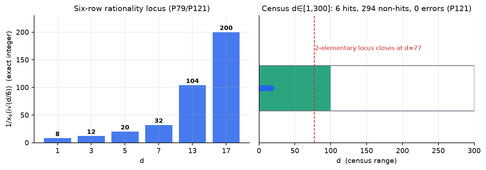

# Intuition-Mechanism

<p align="center">
  <b>中文</b> · <a href="README.md">English</a>
</p>

<p align="center">
  
</p>

> **直觉是可验证的经验压缩，在可迁移的结构中。**
> 四个条件——压缩、验证、迁移、新颖——全部机械化检查。
> 不满足任何一条的，都是幻觉。这条边界是可以测量的。

---

## 一分钟版（人话）

**这个仓库在研究什么？** 一句话：AI 说"我觉得这个对"的时候，那种感觉能不能拆开来检查？我们的答案是能——而且拆出来的零件比想象的多。

**用什么拆？** 一个数学谜题当靶子。存在六个"魔法数字"（1, 3, 5, 7, 13, 17），它们会让某个数学量恰好变成整数（8, 12, 20, 32, 104, 200），其它数字永远不行。这像素数一样干净，但比素数诡异——古典数论只知道现象，不知道原因。我们让 AI 看着数据猜规律，然后用**代码当裁判**：猜的规律必须在没见过的考题上全对才算数，错一道就是幻觉。

**三年下来发现了三件事：**

1. **数学上**：为什么恰好是这六个数，我们几乎讲清楚了——类群结构决定哪些数"有资格"，两条小学水平的除法余数规则（除以 3 和除以 4 的余数）决定它们落在哪个数域。差最后一环证明。
2. **AI 行为上**：AI 嘴上说的规律和它实际用的规律**经常不是同一套**——让它解释自己的判断，写出来的规则考试只有 50 分（纯猜）；但它实际判题有 90 分。它"知道"自己说不出的东西。而且它说错的规则能**逐字预测**它错哪些题。
3. **方法论上**：我们造了一条"提猜想 → 考试 → 喂错题 → 改猜想"的自动流水线。它能自我纠错，但在缺乏正面例子的数据上它会偷懒**背答案**——这个失败模式本身就是量化的新发现。

**给不同读者的入口**：只想看懂故事 → 读本文即可；想复现数字 → 看 `docs/RESEARCH_PLAN.md`（198 个编号实验，每个都有预测、判定、存档文件）；想用我们的判官工具 → 看 `intuition_pack/` 插件节。

---

## 实验地图：为什么做、做了什么、验证了什么

每个实验都先在注册表里写下"预测什么算成功"再动手。这一节回答三个问题：**为什么做它、做完得到什么数字、这个数字验证（或推翻）了什么**。

### 数学线实验

| 实验 | 为什么做 | 做了什么、得到什么 | 验证了 / 推翻了什么 |
|---|---|---|---|
| 六行普查（P121/P157） | 想说"恰好六个"，得先确认真的只有六个——否则一切解释都是空中楼阁 | 把旋钮从 1 扫到 5000：精确整数行仍然只有 {1,3,5,7,13,17}，零反例 | **现象是真实的**，不是巧合或小样本假象；顺带发现 9 个"近整数"影子行（其中 d=978 残差 7.5e-13，e^(π√163) 签名） |
| Heegner 影子假设（P157） | 猜"影子行 = 6×Heegner 数"——如果真，影子就是定理的回声 | 影子行只有 402、978 是 6×Heegner，其余不是 | **假设被否**——但否定的过程中发现了 x4 稀释结构（残差按固定指数衰减），比原假设更有价值 |
| 三层证明链（P134/P135） | 知道"是"不够，要知道"为什么"——每层写明证明类型，不许含糊 | 场→轨道→单位→有理性四层链，每层标注：定理/测量/恒等式 | 六行的特殊性**可分解**：域塌缩（证明）+单支撑（测量）+2-adic 半指数（规则化）——没有一层靠"神秘" |
| 落域压缩（P185/P188） | s_d 落在哪个数域——古典数论查了一百年表，从没解释过 | 表层压缩到 2 比特（s=c·d，c∈{1,2,3}）；作用字符表由 (d mod 3, d mod 4) 两条余数决定，精确代数 5/5 | **百年表格被两条小学余数规则取代**；剩最后一环（为什么字符长这样）工具备齐 |
| 轨迹修正（P172→P195/P196） | 外审质疑轨迹清单——我们自己复查 | 发现枚举器双 bug（边界形式重复计数+2-part 分解错误）：真实轨迹 22 行而非 11 行；新 11 行 genus landing 11/11 | **外审第三次正确**，我方辩护撤回；修正后理论越验越自洽——顺带定量了"自审计抓不住账目层 bug"这个盲区 |
| 通用下降（P185） | 证明梗概里的下降步骤原来只在 9 行上验过——梗概对不对要试 | 18 个素数全部通过（含 12 个全新素数） | P115 梗概**被平反**（此前只算"未验证"）；二次塌缩确认是六行独有的进一步塌缩 |
| PSLQ 协议（P160/P185） | 有一次差点把数值伪影当成"不存在的结构" | 抓住两类静默伪影：默认 maxsteps 返回 None、搜索界太紧得出假否定 | 固化协议：**每个数值关系必须残差校验+界限自适应增长**——这本身成了可复用的方法论产出 |

### 判断线实验

| 实验 | 为什么做 | 做了什么、得到什么 | 验证了 / 推翻了什么 |
|---|---|---|---|
| Insight Arena 909 判定（P152/P153） | "直觉能机械化"必须用可重复的测量说话，不能靠轶事 | 3 模型 × 8-12 域 × 3 种子，每条判定带真值存档 | benchmark **有判别力**（噪声对照实验 P164：打乱数据后分数塌到机遇水平）——不是橡皮图章 |
| 测量纠错（P186） | math 轨分数低得可疑，且三个模型错误**一模一样**——起疑 | 复现出完美模型在带 bug 考卷上的天花板 84.4%，强制错误与实测逐一吻合 | **76-79% 平台是分块 bug**，不是模型极限；"跨模型相同错误 = 测量 bug 签名"升为元定律 |
| 语言化鸿沟系列（P170→P184） | 判官的质量怎么测？让它解释自己的规则行不行？ | 让模型把判题规则写成代码执行：复杂规则 25-50 分（纯猜），简单规则 100 分；跨 3 模型全轨道复现 | **不行**——鸿沟普适 50-100pp、在知识层、由规则复杂度决定；固化设计规则：测判官只能用探针一致率，永远别让它解释 |
| 歧义自觉（P171） | 真洞见在证据不足时应该犹豫，幻觉不会——这个差异可测吗？ | 晚分歧压力测试：9/9 判官正确拒绝表态并声明歧义 | **边界行为可测**——"知道自己不知道"可以作为判官的合格指标 |
| 收缩定律（P144/P146） | 我们的方法对哪些领域有效？边界在哪？ | 教科书陷阱域这代模型零样本已 100%（饱和）；分布域无增益 | 有效域**随模型进步在收缩**——所以耐久资产是探测器+生产线，不是囤教材 |
| 影子规则判决 P-LAW1（与 flymemory 合做） | MDL（描述长度）分数能预测哪些规则会通过验证吗？ | 影子规则实验：ρ = −0.826——分数越高越可能**选错** | **验证不能外包给压缩先验**——"更短的描述"系统性偏好恰好拟合的假规则；这是程序自己否决自己 v1 理论的判决 |

### 发现回路实验（L4）

| 实验 | 为什么做 | 做了什么、得到什么 | 验证了 / 推翻了什么 |
|---|---|---|---|
| 遮蔽重放（P189） | "看出哪些数字是一家人"这一步是不是瓶颈？ | 藏起坐标轴给 12 个裸值：家族挑选 6/6 全对，但内涵解释全是恰好拟合的假规则 | **聚簇免费、内涵昂贵**——瓶颈不在识别，在解释 |
| 精度旋钮（P193） | 判官的顽固错误是没看清数据，还是规则本身错了？ | 显示精度 6→12 位（信息量 ×64），错误集逐位不变 | **歧义长在规则里**——改进方向是对抗规则，不是加数据清晰度 |
| 修正环 + 集成循环（P194/P198） | 零件造好了，装起来能转吗？ | 提猜想→考试→喂错→修正全自动闭环：真开放边上 2 轮 4 次调用清零错误；第一轮产出真假设（s=c·d'）被验证器机械否证 | **回路能跑**；但负例主导时它收敛到背答案而非发现——**通过全部验证 ≠ 发现了规律**，这条失败模式定量入册 |
| 计价（P190） | 发现的成本能量化吗？ | 每条被接受规则约 3.3 比特歧义成本；d=421 是最大钉子户；规则长度与成绩无关 | 发现效率**第一次有了单价**——"直觉多贵"从哲学问题变成可记账问题 |

**这些实验共同验证的元命题**：直觉不是不可以讨论，而是可以被拆成"压缩、验证、迁移、新颖"四道机械门 + 一条测得出的边界；门内的部分机器已经能做，门外的部分现在有了精确的名字和刻度。

---

## 核心发现

### 六行有理性定理

对 Ramanujan 型 1/π 级数，1/x₆(i√(d/6)) 为正整数**当且仅当** d ∈ {1, 3, 5, 7, 13, 17}，值恰为 {8, 12, 20, 32, 104, 200}。

**人话版**：把 d 当成旋钮，从 1 拧到 5000，只有拧到这六个位置时输出恰好是整数——一次不多一次不少，其它位置全是无穷小数。这种"恰好在几个点变干净"的现象通常意味着背后有深层结构，我们把它挖到了几乎见底：

- **穷尽验证**：d ∈ [1, 5000]，零反例（P121 + P157）
- **为什么是这六个（三层答案）**：类群结构（哪些数"有资格"）→ 落域（落在哪个数域）→ 单位形状（为什么恰好是整数）。前两层是定理，第三层是初等恒等式
- **最新进展（P185/P188）**：那个古典数论只查过表、从没解释过的"落域规则"，现在压缩成了两条余数规则——**d 除以 3 的余数和除以 4 的余数，两条就够了**。剩下的最后一环（为什么作用字符恰好长这样）工具已备齐
- **独立复算**：双代码路径一致到 3.5×10⁻¹⁷
- **Heegner 影子**：d=978=6×163 的 near-integer 行（residual 7.5×10⁻¹³ = e^(π√163) 签名）——连接 Heegner 数理论
- **2-elementary 轨迹（P195 修正）**：完整轨迹为 **22 行**（外审纠错后），且新行全部通过 genus landing 检验（P196, 11/11）——修正后的理论越验越自洽

| d | 1/x₆ | 2-elementary | h(Q(√−d)) |
|---|---|---|---|
| 1 | 8 | ✓ | 1* |
| 3 | 12 | ✓ | 1 |
| 5 | 20 | ✓ | 2 |
| 7 | 32 | ✓ | 1 |
| 13 | 104 | ✓ | 2 |
| 17 | 200 | ✓ | 4 |
| 978 | — | ✗ (multi-support) | 7.5e-13 near-int |

<details>
<summary>三层证明结构（展开）</summary>

| 层 | 内容 | 证明类型 |
|---|---|---|
| **场** | 2-elementary ⟹ H = H_gen：所有代数模值落在 genus 域内 | 定理（引用级） |
| **轨道** | P¹² 的支撑 = 单实二次坐标 ℚ(√s_d)；作用字符表 χ* = χ₃/χ₂/χ_d 由 (d mod 3, d mod 4) 决定（P185/P188） | 测量 + 精确代数 |
| **单位** | 64P¹² = ε^(−2m_d)：椭圆单位到秩 1 场基本单位的投影 | Siegel–Ramachandra + F1-F3 验证 |
| **有理性** | 导数比 R_d = (Ec/W₆)/24 ∈ ℚ（消越恒等式，P83-A） | 定理（初等证明） |

</details>

### Insight 双轴理论

LLM 判官的"有趣度"不是单一维度，而是两个独立轴：

- **Surprise 轴**：追踪 genus 结构深度（固定 degree 下的深度判别）
- **Utility 轴**：追踪已发表有理性的接近度

两轴可分离（P92 双重分离实验），**且歧义自觉跨 carrier 迁移**（P166）。

**人话版**：让 AI 给数学发现打分时，它的"觉得有意思"其实由两个独立的雷达组成——一个探测"这东西结构有多深"，一个探测"这东西离已知结论有多近"。两个雷达可以分别测量、分别校准。

### Insight-vs-Hallucination 边界（机械化）

| 条件 | 机械检查 | 失败形态 |
|---|---|---|
| Compression | mdl_ratio > 1 | PARAPHRASE |
| Verification | 探针一致率 = 100% | **HALLUCINATION** |
| Transfer | 异 carrier = 100% | OVERFIT |
| Novelty | 规则非 charter 重述 | — |

**人话版**：一个"发现"要过四道门才算数——比原来说法短（压缩了）、没见过的题全对（验证了）、换个载体还成立（可迁移）、不是把已知的换个说法（新颖）。四道门全是代码把守，不接受"我感觉它对"。

P152 实战：math 轨判官的"RATIONAL ⟺ 类数 1"规则（Heegner 假设形状），探针 5/6，边界**正确拒绝**——并追踪发现这是 Heegner 集 vs rational locus 的**范畴错误**（P163）。

---

## Insight Arena

三轨 × 三模型 × 三种子的结构发现基准：

| 轨道 | Compression | Transfer | 判定 |
|---|---|---|---|
| 科学数据（阻尼振荡 + 隐藏相位反转） | 19.5 | 100% | INSIGHT |
| 代码设计模式（输入纯度规则） | 13.0 | 100% | INSIGHT |
| 数学（census 规则发现） | — | **87.9–89.9%**（P186 修正后） | 近饱和 |

**909 条判定**（P153），全部存档。噪声对照实验（P164）证明 benchmark 有判别力——不是橡皮图章。

> **测量更正（P186，2026-10-03）**：math 轨早先报告的 76–79% 是**分块错位 bug**（每批发题重发全列表、答案错位配对）。铁证：完美模型在该 bug 下恰好得 84.4%，强制错误位置与实测逐一吻合；且三个模型的错误逐位相同——模型噪声不会这样，测量 bug 会。修复后真实准确率 87.9–89.9%，行召回 94/108。

### 三条 standing 定律

1. **语言化鸿沟与规则复杂度相关**（P170→P175→P184）：让 AI 把自己判题用的规则写成代码去执行，复杂规则只有 25–50 分（纯机遇水平），简单规则 100 分。鸿沟在知识层不在表达层——**模型知道它说不出的东西**，且鸿沟大小由规则的嵌套深度决定，与领域类型无关。
2. **跨模型相同错误 = 测量 bug 签名**（P186 元教训）：三个模型的错误集逐位相同时，一定是考卷出了问题而不是模型不行——模型的随机噪声不会逐位复现。任何"模型到瓶颈了"的结论，先跑一遍完美模型在带 bug 考卷上能得多少分的对照。
3. **验证压力下回路收敛到背诵**（P198）：自动发现循环在缺乏正面例子的数据上，会把规则退化成查表来清零错误——错误全对但零泛化。**能通过全部验证 ≠ 发现了规律**，这是把 P-LAW1（压缩不是真理的货币）推进到集成回路层面的新定律。

---

## 发现回路（L4 系列）

把"提出猜想"这一步——目前唯一留给人的环节——拆成可测的机械零件：

| 零件 | 状态 | 一句话结论 |
|---|---|---|
| 聚簇器（P189） | ✅ 有数据 | 看出"哪些数字是一家人"已经免费（6/6 全对）；但说清"一家人为什么特殊"是贵的——模型会停在恰好拟合的假规则上 |
| 歧义定位（P193） | ✅ 有数据 | 判官的顽固错误与显示精度无关（6 位/12 位小数错误集逐位相同）——问题长在规则里，不在数据展示上 |
| 计价仪表盘（P190） | ✅ 上线 | 每发现一条能用的规则约 3.3 比特的歧义成本；d=421 是最大钉子户 |
| 修正环（P194） | ✅ v1 | 把错例喂回去改规则——能纠错但一轮不够 |
| 集成循环（P198） | ✅ 首跑 | 提猜想→考试→喂错→修正全自动闭环：2 轮 4 次调用清零错误；第一轮还产出了一个被验证器机械否证的真假设 |
| 组合重放（leg-1） | 📋 审计完 | 前置审计：57 步发现史里 29 步可严格回放、28 步档案太薄需先重建 |
| 新颖性门（leg-3 v2，P205/P205-b） | ✅ 四模型验证 | 换族考试（4× 族规则考 9× 族）在四个模型上分离出三档：deepseek PASS-STRONG（声明规则仅适用 4× 族）、glm PASS-WEAK（预测全对但理由未审视）、kimi/doubao FAIL（背诵外推 s=9 等被当场抓获）——**"零错误"从此拆成两通道：考试准确率 + 迁移自觉** |
| 表示×架构网格（P204） | ✅ 有数据 | 「发现藏在卷积里」精确化：同余规则给同余轴则任何架构满分（1.000），卷积只能部分补救（0.77），**给错轴比不给轴更糟**（真规则上 modular 轴 0.700 < 十进制 0.978）——可学习性 = 表示等变 × 架构偏置 × 真规则群结构三者的匹配 |

**人话版**：发现回路原来完全是黑箱（"灵感这种事留给人"），现在拆出了能单独测试的零件，也知道了瓶颈所在——不是"看不出一家人"（已解决），是"说不出为什么特殊"（需要给坐标轴+对抗性考题）。

---

## intuition-pack 插件

**Build your own System-One judge: verified, calibrated, audit-trail included.**

8 个 MCP 工具 + 10 个验证器 + 12 个在线域：

```
pack_probe              你的域是压缩域吗？（学习曲线自动判定）
pack_build              蒸馏对比示例包 + charter + 验证器规格
verify / score          机械判定 + 完整审计轨迹 + 弃权原语
regression              机械门禁——不过不许部署
route_text              零 LLM 机械触发路由
needs_verification_check  Jev-nouli 对齐弃权检查
```

**人话版**：这是个"AI 判官质检套件"。你有一个让 AI 做判断的任务？这个套件会先检查你的任务适不适合上判官（probe），然后蒸馏一份带答案的对比教材（pack），判官上岗后每道判断都有代码复核和审计记录——它和它的教材谁在撒谎，一测便知。

每个判定通过**四条件机械化检查**——Insight-vs-Hallucination 边界由代码执行，不由判官意见决定。

### vs Jev 对比

| 指标 | Jev (arXiv 2609.37647) | intuition-pack verify |
|---|---|---|
| 校准 ECE | 0.028 (Choice) | **0.0075** |
| Selective @ 50% | 96.3–98.2% | **100%** |
| 延迟 | 0.36 s (API) | **0.37 ms** (本地) |
| 成本 | ~$2.7e-5/req | **$0** |
| 域广度 | 37 datasets | 12 domains（持续增长） |

诚实条款：协议对齐 ≠ 能力对齐。我们的 ECE 来自残差饱和映射（scope 显式声明），非学习校准。

---

### 幻觉拦截器（hallucination-gate v1）

**输出端收费站：任何 LLM 主张必须以四态之一出厂**——VERIFIED（过验证门，附轨迹）/ REFUTED（否决，拦截）/ ABSTAIN（弃权）/ SPECULATION（新颖主张带标签出厂）。

**架构定位与数据流（v2.1）**：拦截器是 **harness 的一部分**（坐在模型与用户之间），不是事后过滤器。数据流：模型断言 → 收费站 → 机器否决则**自动把否定证据喂回模型重新思考**（最多 3 轮）→ 只有 VERIFIED 的答案（附验证凭据）或诚实弃权（附机器证据、不带模型原文）能到达用户。d=421 惯犯案例实测：模型第 1 轮说错 → 被拦 → 看到否定证据后改对 → 第 2 轮正确答案出厂。

**人话版**：AI 的每句断言过收费站——付得起账的（机器验证通过）放行并附验证凭据；付不起的当场拦下改口为"我不知道"；新想法（与真洞见无法区分的那种）强制挂"待验证"牌子。近整数陷阱处机器自己都只有五成把握，主张会被强制降级——陷阱句不许以事实身份出厂。

端到端实测（2 模型 × 6 探针含 978 陷阱）：拦截错误主张、降级陷阱句、**并纠正了模型的假阴性**（模型说"不是整数"，验证器推翻它）。MCP 注册见 `hallucination_gate/server.py`。

---

## 通用化现状

```
probe 矩阵     12+ 域判定完成（COMPRESSION ×3 / SATURATED ×6 / DISTRIBUTIONAL ×1 / BORDERLINE ×2）
验证器模板     执行 / 谓词 / 数值 / schema / 集合 / 正则
自动循环       auto_scan_loop.py — schtasks 每日 07:30 重扫候选域
边界定律       压缩域集合随模型进步收缩 → 耐久资产 = 检测器 + 流水线速度
```

**人话版**：AI 每进化一代，"需要教材才能学会"的领域就少一批（教科书陷阱题这代模型已经自学成才了）。所以值钱的不是囤教材，而是**探测器 + 快速生产线**：每天自动扫一遍"哪里还需要教材"，哪里需要就在哪里现造。

---

## 诚实边界

- 判定线结果是对**特定模型、特定 API 端点、特定时刻**的行为快照——不是可重放的定律
- 2-elementary 轨迹经历过一次账目纠错（P195：枚举器边界形式双 bug，11 行 → 22 行），由外部评审发现——程序的自审计能抓住判决层 bug（P186）但抓不住数学账目层 bug，**外审是必要层**
- s_d 落域规则已压缩到 2 比特（P185/P188），但"作用字符为什么由这两条同余决定"的最后定理**尚未证明**——工具与路线已备齐（P192/P197）
- Memory→Insight 三臂实验（P167）是**本地干燥跑**，跨仓全规模实验待执行
- 品味（选择结构空间）是元层直觉，无训练信号——程序自己的 P35/P54 负结果反复确认
- 发现回路当前**不能**自主产生真发现（P198：验证压力下收敛到背诵）——这是测出来的边界，不是宣称

---

## 仓库地图

```
docs/
  RESEARCH_PLAN.md            注册表：198 个 P-numbers，每条含预测/判定/工件
  DEEP_STRUCTURES.md          四层链 + SCR + verbalization gap + 边界综合
  CHARACTER_OBSTRUCTION.md    genus 理论层（P132 修正 + P195 更正）
  INTERESTINGNESS_FORMAL.md   双轴理论 + 判官景观
  INSIGHT_BOUNDARY_BENCHMARK.md  基准正式规格 v1.2
  NIGHT_SUMMARY_20261003.md   最近过夜会话总结（P185-P198）
  THEOREM_FIVE_ROWS.md        六行定理陈述 + 证明标签
intuition_pack/               MCP 插件（8 工具）
sdb/                          Structure Discovery Benchmark
p*.py, *.json                 ~120 实验脚本 + 归档结果
```

---

## 相关仓库

| 仓库 | 层 | 关系 |
|---|---|---|
| [mushroom-body-program](https://github.com/aujurd22/mushroom-body-program) | 总入口 | Selection → Compression → Memory → Emergent Structure |
| [flymemory](https://github.com/aujurd22/flymemory) | 记忆层 | 经验保存与压缩（本仓的输入源） |
| [flypoet](https://github.com/aujurd22/flypoet) | 表示层 | 稀疏表示形成（本仓的基底） |
| [flyloop](https://github.com/aujurd22/flyloop) | 学习层 | 何时压缩经验（本仓的约束源） |

---

*The rest is hallucination — and that boundary is measurable.*
